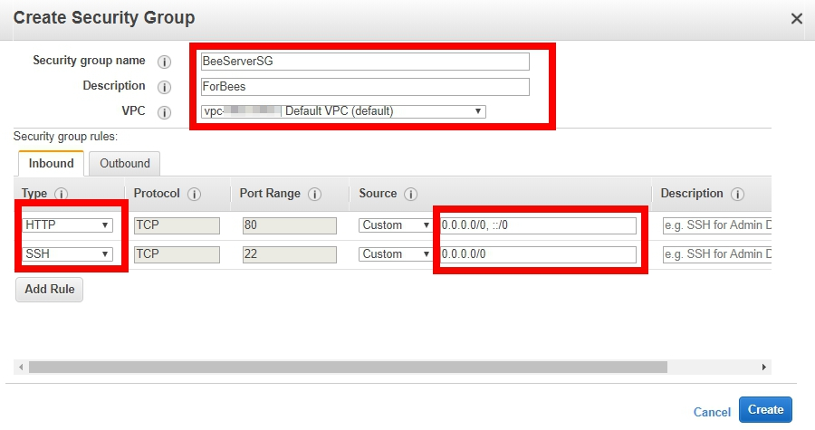
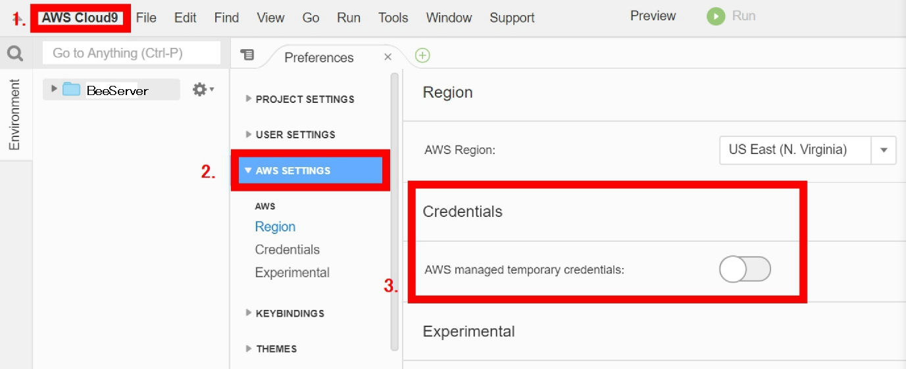
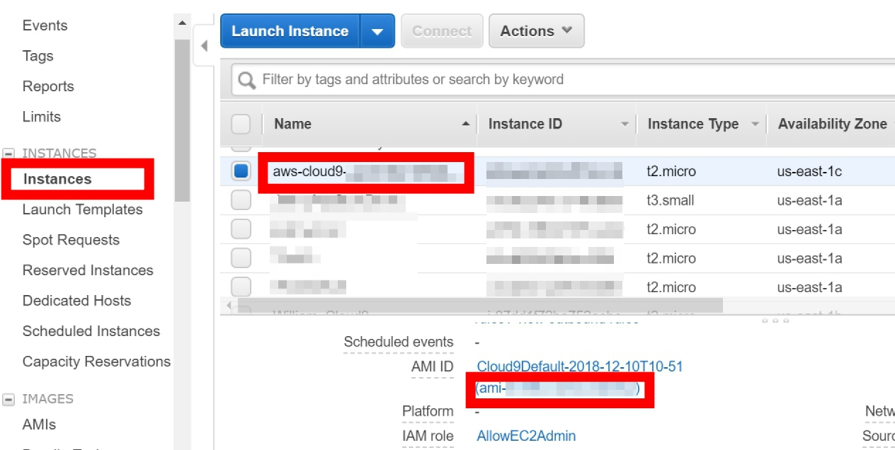
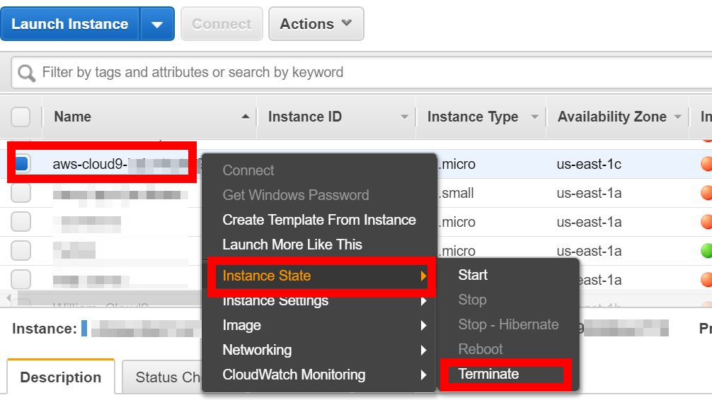
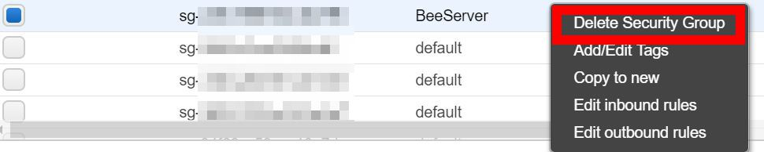

# Test Auto Scaling EC2 with BeeswithMachineGuns

## Scenario
This lab use [BeeswithMachineGuns](https://github.com/newsapps/beeswithmachineguns/blob/master/README.textile) to test Auto Scaling EC2. You will create a Bee Server to manage little bees to attack an elastic load balancer.**Please do it carefully to avoid incorrect attack**.

## Prerequisites
>The workshop’s region will be in ‘N.Virginia’

>Prepare a [Web Server instance](https://github.com/ecloudvalley/Launch-an-Amazon-EC2-in-LAMP-Environment)

>Prepare an [Auto Scaling group with Elatic Load Balance](https://github.com/ecloudvalley/Auto-Scaling-EC2-with-Custom-Scaling-Policy)

## Lab tutorial
### Create Security Groups for Bees

1. On the **Service** menu, click **EC2**.

2. In the navigation pane, click **Security Groups**.

3. Click **Create Security Groups**.

4. Input the followings:

    * Security group name : `BeeServerSG`
    * Description : `ForBees`
    * VPC : Choose `Default VPC`

5. Create Inbound rules:

    * Type : `HTTP`, Port Range: `80` 
    * Type : `SSH`, Port Range: `22` 

<p align="center">
    
</p>

### Create an Cloud 9 instance in Amazon Web Service
[AWS Cloud9](https://aws.amazon.com/cloud9/) is a cloud-based integrated development environment (IDE) that lets you write, run, and debug your code with just a browser. It includes a code editor, debugger, and terminal.Since your Cloud9 IDE is cloud-based, you can work on your projects from your office, home, or anywhere using an internet-connected machine.We're going to use Cloud 9 as BeeServer to set up bee instances.

1. On the **service** menu, click **Cloud 9**.

2. Click **Create environment**.

3. Input the **name** text : `BeeServer` , and click **Next step**.

4. In **environment settings**, leave everything as default and click **Next step**.

> Because we just need a easy lab, the default setting will satisfiy our demand.

5. Review the name and settings, and click **Create environment**.

> Now you will get a cloud 9 EC2, you can start it on the webpage.

### Change Bee Server credential and IAM Role
 We want to accomplish access control by attaching a role ourself, we need to turn off the Cloud9 temporarily provided [IAM](https://aws.amazon.com/iam/) credentials first.

1. Click **AWS Cloud9** on the top list.

2. Choose **Preferences**.

3. Scroll down and click **AWS settings**.

4. Change **Credential** to **off**.

<p align="center">
    
</p>

5. On the **Service** menu, click **EC2**.

6. Right-click the EC2 instance named with `aws-cloud9` prefix and click **Instance Settings** -> **Attach/Replace IAM Role**. 

7. Click **IAM Role** and select **AllowEC2Admin**, click **Apply** to save your change.

### Setup Bee Server environment using Cloud 9

1. On the **Service** menu, click Cloud 9.

2. Click **File** on the top and select **Upload local file**

3. Click **Select files** and Select your **Keypair**.

>**Notice** that Cloud 9 is base on Linux system, make sure to upload **Keypair.pem** not **.ppk**

4. Move our keypair to the right location, look at the bottom of Cloud 9 and input:

```sudo mv MyAmazonKeypair.pem /home/ec2-user/.ssh```

5. Install Python-Paramiko

```sudo yum install python-paramiko git```

6. Go to tmp folder, clone **BeesWithMachineGuns** to Cloud 9

```cd /tmp```

```sudo git clone https://github.com/newsapps/beeswithmachineguns.git```

7. Install BeesWithMachineGuns

```cd beeswithmachineguns/```

```sudo python setup.py install```

8. Create .boto config

```cd /home/ec2-user/```

```nano .boto```

9. Input information to .boto config

```
[Boto]

ec2_region_name=us-east-1

ec2_region_endpoint=us-east-1.ec2.amazonaws.com

#elb_region_name=us-east-1

#elb_region_endpoint=elasticloadbalancing.us-east-1.amazonaws.com
```

> **Notice** that we used to put Acccess Key ID and Secret Access Key ID in .boto before. Since we add IAM role, we don't need it anymore.

### Generate Bee instances and test a target

1. Enter the right location to generate Bees

```cd /home/ec2-user/.ssh/```

> Since we're going to generate bees, we need to check out the commands we use

>bees up : generate bees instances on AWS
bees down : stop and terminate all bees on AWS
bees report : monitor all bees and send a report to BeeServer
bees attack : conduct your bees to attack a target!


>bees up
-s : number of bees
-k : keypair name
-z : available zone
-g : security group name
-l : username
-i : AMI id
-t : instance type


>bees attack
-n : attack times
-c : participate bees number
-k : keypair name
-u : target location'


2. Generate Bees using Bees up command

You can type some important part of command and leave others default, like:

```bees up -s 2 -k MyAmazonKeypair```

But we suggest the complete command:

```bees up -s 2 -k MyAmazonKeypair -z us-east-1a -g BeeServerSG -l ec2-user -i ami-xxxxxxxx -t t2.micro```

You can find your AMI ID in here:

<p align="center">
    
</p>

3. Wait for Bees to load their machine guns, and type `bees report` to check their status.

4. Test your Elastic Load Balancer or Web Server using bees attack command:

>**Notice again,to avoid unnecessary attack,do not try any other website!**


```bees attack -n 1000 -c 2 -k MyAmazonKeypair -u http://WebServerLB-XXXXXXXXX.us-east-1.elb.amazonaws.com/```


5. While Finished, use `bees down` to clean up all bees.

### Clean up

* All bee instances
Use `bees down` in command line, it will stop and terminate all bee instances.

* Cloud 9 Bee Server

1. Click on **Service** menu, choose **EC2**.

2. In the navigation pane, click **Instance**.

3. Right-click the EC2 instance named with `aws-cloud9` prefix and click **Instance state**, choose **Terminate** to terminate Bee Server.

<p align="center">
    
</p>

* Bee Security Group

1. In the navigation pane, click **Security Groups**.

2. Right-click the security group named with `BeeServerSG` prefix and click **Delete Security Group**.

<p align="center">
    
</p>

### Conclusion

Congratulations! now you have learned:
* Create a Cloud 9 EC2 instance
* Use Cloud 9 as a server to call up EC2 instances
* How to test Web Server or Elastic Load Balancer with BeeswithMachineGuns