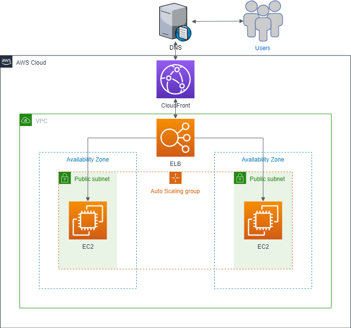
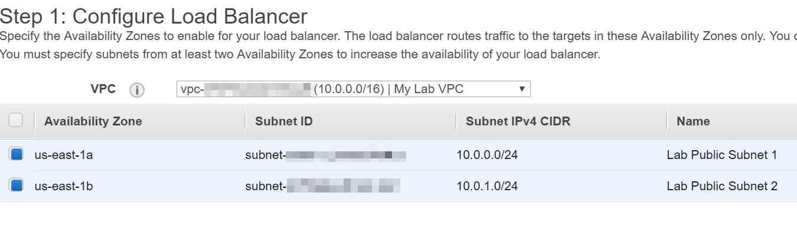
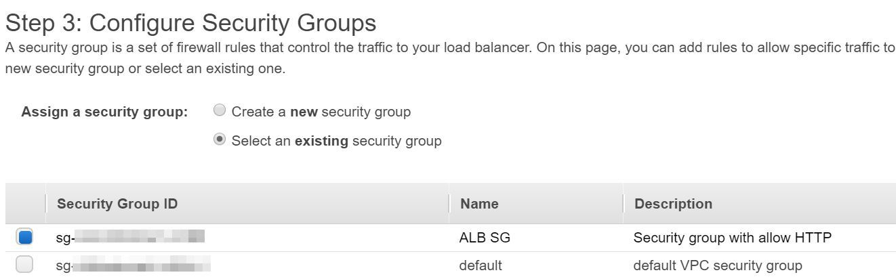
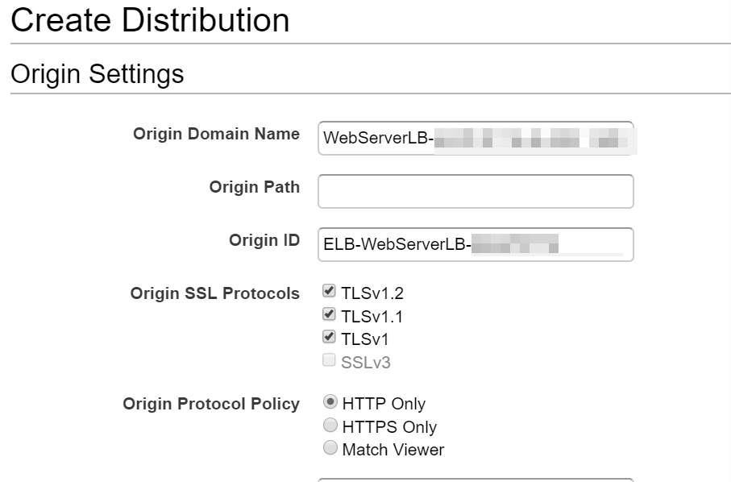
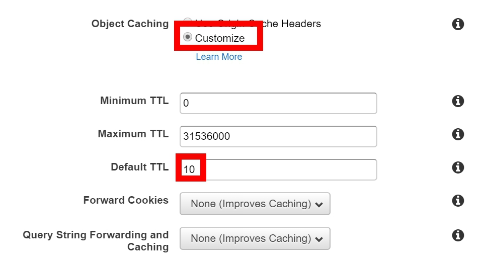
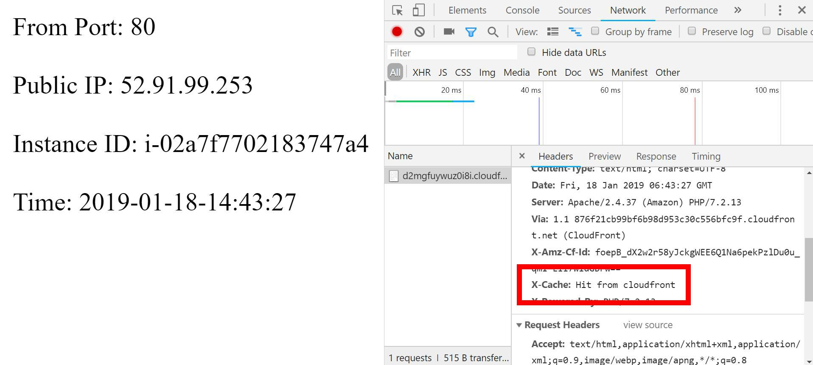

# How to build an elastic structure

## Scenario
The following procedures help you set up a scaled and load-balanced application, you will attach a load balancer to your Auto Scaling group. The load balancer automatically distributes incoming traffic across the instances in the group. And a CloudFront generates by Load balancer. This tutorial attaches a load balancer to an Auto Scaling group when you create the group, and set up a scaling policy to be triggered of target tracking scaling policy.

<p align="center">
    
</p>

## Prerequisites
> The workshop’s region will be in ‘N.Virginia’

> Prepare VPC, if there's no VPC's,you can use [lab-network](lab-network_yaml.yaml/) to deploy

## Lab tutorial
### Create Load Balancer and Target Group

[Elastic Load Balancing](https://aws.amazon.com/elasticloadbalancing/) automatically distributes incoming application traffic across multiple targets, such as EC2 instances, containers, IP addresses, and Lambda functions. It also can handle the varying load of your application traffic in a single Availability Zone or across multiple Availability Zones.
This part will walk you to create an Application Load Balancer to distributes incoming application traffic to EC2. 

1. On the **service** menu, click **EC2**.
    
2. In the navigation pane, click **Load Balancers**.
    
3. Click **Create Load Balancer**.
    
4. Choose **Application Load Balancer**, and click **Create**.

5. Specify the following settings:

    * Name: `WebServerLB`
    * Scheme: choose **internet-facing**
    * VPC: select **My Lab VPC**, choose Subnet with **name** **Lab Public Subnet 1** and **Lab Public Subnet 2** 

<p align="center">
    
</p>

6. Click **Next: Configure Security Settings**.

7. Click **Next: Configure Security Groups**.

8. Select **Select an existing security group**, choose `ALB SG`.

<p align="center">
    
</p>

9. Click **Next: Configure Routing**.

10. Enter the following information, and leave other as default:

    * Name: `WebServerTG`

11. Click **Next: Register Targets**.
    > Because there's no EC2 yet, we'll register it later.

12. Click **Next:Review**.

13. Click **Create**.

14. Click **Close**.

### Create a CloudFront using Load Balancer

[CloudFront](https://aws.amazon.com/cloudfront/?nc1=h_ls) is a fast content delivery network (CDN), it will securely deliver data, videos, applications, and APIs to customers globally with low latency, high transfer speeds. Cloudfront will also give our Elastic Load Balancer new domain name. The ELB we use in this case is the one we created in the first step.

1. On the **Service** menu, choose **CloudFront**.

2. Choose **Create Distribution**.

3. Create a web distribution, click **Get Started**.

4. In **Create Distribution**, enter the following information and leave other as default:
    * Origin Domain Name : `WebServerLB`
    * Object Caching : **Customize**
    * Default TTL : `10`

<p align="center">
    
</p>

<p align="center">
    
</p>

5. Choose **Create Distribution** to deploy CloudFront distribution.

It will take 20 ~ 40 minutes, do the following steps beside waiting.

### Create Auto Scaling Group
Create a Launch Configuration and Auto-Scaling Group to manage the EC2 which create automatically. We can separate this step into two part:

#### Create Launch Configuration

[Launch configuration](https://docs.aws.amazon.com/autoscaling/ec2/userguide/LaunchConfiguration.html) is an instance configuration template that an Auto Scaling group uses to launch EC2 instances. When you create a launch configuration, you specify information for the instances. Include the ID of the Amazon Machine Image (AMI), the instance type, a key pair, one or more security groups, and a block device mapping. We're telling you how to set up the details about scaling instances.

1. On the **service** menu, click **EC2**.

2. In the navigation pane, click **Auto Scaling Groups**.

3. Click **Create Auto Scaling group**.

4. Choose **Launch Configuration**, choose **Create a new launch configuration**, then click **Next Step**.

5. In the navigation pane, choose **Quick Start**, in the row for the second **Amazon Linux AMI**, click **Select**.

6. Select instance type **t2.micro** and click **Next:Configure details**

7. In the Configure details, enter Name: `Auto-Scaling-Launch`

8. Specify the following settings:
    * Purchasing option: select **Request Spot Instance**
    * Maximum price: **0.05**
    * User data: copy the following 
```
#!/bin/bash
# Install Apache Web Server and PHP 
yum install -y php72 wget httpd24
# Download Lab files 
wget https://raw.githubusercontent.com/ecloudvalley/How-to-build-an-elastic-structure/master/index.php
mv index.php /var/www/html/
# Turn on web server 
chkconfig httpd on 
service httpd start
```

> Because Spot Instance is cheaper than On-Demand instance, so we choose Spot Instance for Auto Scaling instances.

9. Click **Next: Add Storage**

10. Click **Next: Configure Security Group**

11. Select **Select an existing security group** , choose `Web SG`.

12. Click **Review**.

13. Review the details of your launch configuration and click **Create launch configuration**.

14. Click **Proceed without a keypair**, select the acknowledgment box, and click **Create launch configuration**.

#### Create Auto Scaling group

 [Auto Scaling](https://aws.amazon.com/autoscaling/?nc1=h_ls) monitors your applications and automatically adjusts capacity to maintain steady, predictable performance at the lowest possible cost. Using AWS Auto Scaling, it’s easy to setup application scaling for multiple resources across multiple services in minutes. Scaling Policy can be customized in several ways.

15. On the Create Auto Scaling Group, enter the following detail:

    * Group name: `Auto-Scaling-Group`
    * Group size: Start with `1` instance
    * Network: select **My Lab VPC**
    * Subnet: select both **Lab Public Subnet 1** and **Lab Public Subnet 2**

16. Scroll down and expand **Advanced Details**, and select **Receive traffic from one or more load balancers**.

17. Click in the **Target Groups** textbox and then click **WebServerTG**.

18. Click **Next: Configure scaling policies**.

19. Click **Use scaling policies to adjust the capacity of this group**.

20. Modify the **Scale between** textbox to scale between **1** and **5** instances.

21. Specify the following settings:
    * Name: **Scale Group Size**
    * Metric type: **Average CPU Utilization**
    * Target value: **70**

22. Click **Next: Configure Notifications**.

23. Click **Next: Configure Tags**, enter the following details:

    * Key: **Name**
    * Value: **AutoScaling Instance**

24. Click **Review**.

25. Review the details of your Auto Scaling group, then click **Create Auto Scaling group**.

26. Click **Close** when your Auto Scaling has been created.

### Test your website 

The CloudFront created before must successfully deploy now, we can test it to see if it works like expectation.

#### ALB
In the ALB Website, the web page will be changed since refresh the browser. There's no cache in ALB.
1. In the navigation pane, click **Load Balancer**.

2. Check the **Description** tag bellow, copy **DNS name** and paste it to the browser.

Now you can see the **Port**, **Public IP**,**Instance ID** and **Time** shown on the page.

3. Press **Refresh** to see the difference between the website.

#### Cloudfront

In the Cloudfront Website, cache can be customized. Reducing the duration allows you to serve dynamic content. Increasing the duration means your users get better performance.

1. Click On the **Service** menu, click **CloudFront**.

2. Copy the **Domain name** of your Cloudfront, paste it to the browser.

3. Now you can see the **Port**, **Public IP**,**Instance ID** and **Time** shown on the page.

3. Press **F12** on the keyboard, click **Network**.

4. Press **F5** to refresh the page, click the file under **Name**

5. View the **X-Cache**, now you will see **Hit from CloudFront**

<p align="center">
    
</p>

## Clean up
Make sure to clean up the service we just created.

* Cloudfront, disable and delete

    1. On the **Service** menu, Click **Cloudfront**.

    2. Select the CloudFront with **Origin name** `WebServerLB`

    3. Click **Disable**

    > Wait until the **state** become **Disabled**

    4. Select the same CloudFront and click **Delete** on the top

* WebServer Instance

    1. Click on **Service** menu, choose **EC2**.

    2. Right click on **WebServer** and choose **terminate**.

* Launch Configuration and Auto Scaling Group

    1. In the navigation pane, choose **Launch Configurations**.

    2. Right click on **Auto Scaling Launch** and choose **Delete launch configuration**.

    3. In the navigation pane, choose **Auto Scaling Groups**.

    4. Right click on **Auto-Scaling-Group** and choose **Delete**.

* Load Balancer and Target Group

    1. In the navigation pane, choose **Load Balancers**.

    2. Right click on **WebServerLB** and choose **Delete**.

    3. In the navigation pane, choose **Target Groups**.

    4. Right click on **WebServerTG** and choose **Delete**

## Conclusion
Congratulations! now you have learned:

* Create a Cloudfront
* Create Load Balancer and Target Group
* Create Launch Configuration and Auto Scaling Group
* Trigger Auto Scaling Group with Target Tracking Scaling Policy

## Appendix
To test the Website and Elastic Load Balancer, you can try [Bees-with-Machine-Guns](Bees-with-Machine-Guns/)